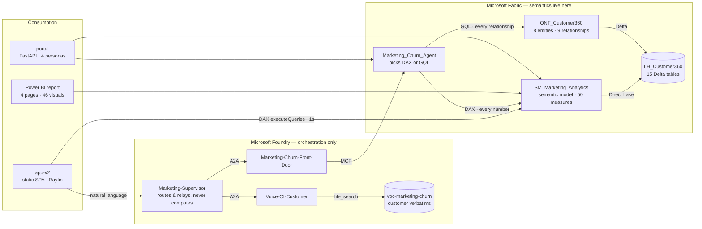
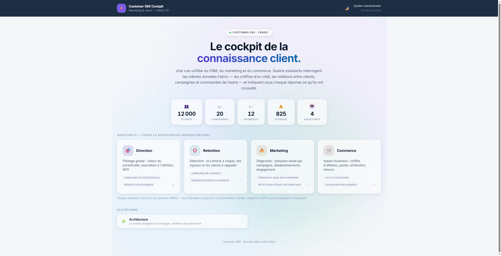
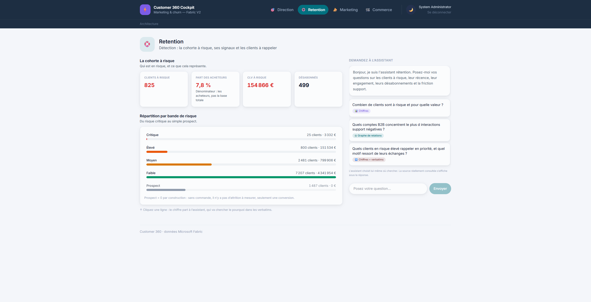
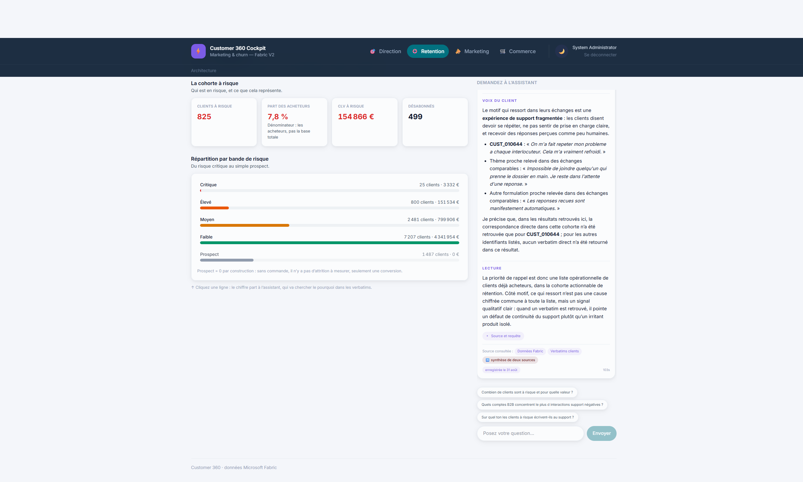
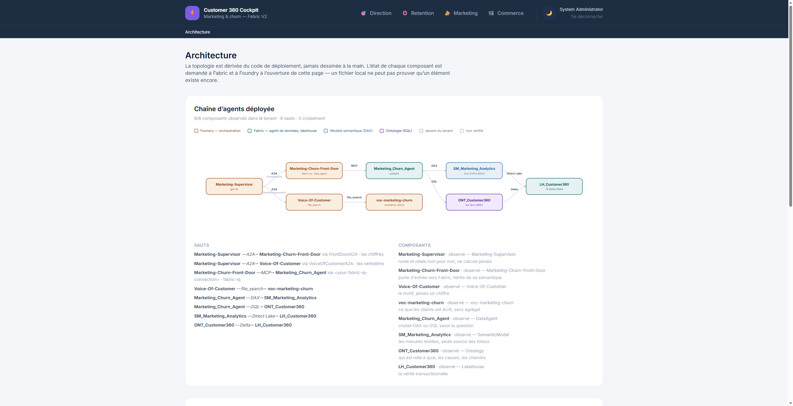
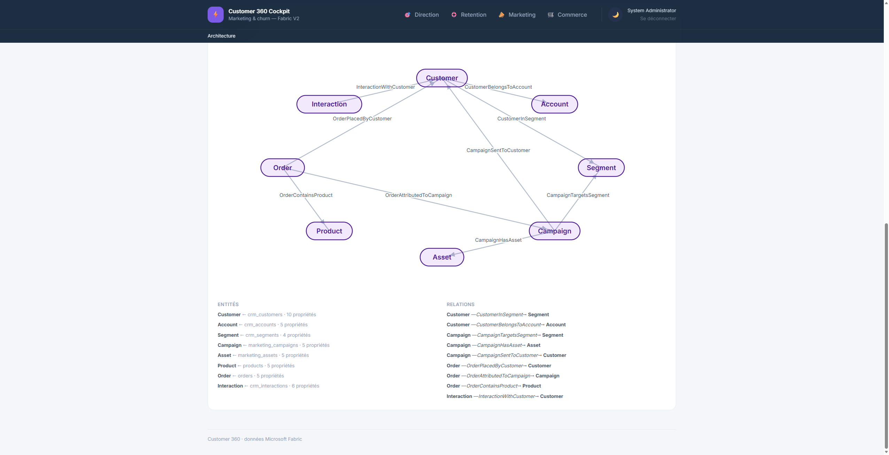

# Customer 360 & Churn — a Microsoft Fabric demo

A complete Customer 360 and churn analytics platform on Microsoft Fabric: CRM, marketing and
commerce in one Lakehouse, a Direct Lake semantic model, an ontology and knowledge graph, a
dual-source data agent, a Power BI report, and a conversational cockpit where four assistants
answer in natural language — and show where they looked.


-blue?style=for-the-badge)

[](https://github.com/Statyx/Fab-Marketing-Campaign/actions/workflows/no-client-leak.yml)

> **All data in this repository is synthetic**, generated from a seed by
> [`src/generate_data.py`](src/generate_data.py). No real customer, account or campaign appears
> anywhere. The workspace name, capacity and tenant are read from a gitignored
> `src/config.yaml` — see [`src/config.example.yaml`](src/config.example.yaml).

Deployment is one command and is idempotent — see [Quick start](#quick-start).
Design rationale lives in [`docs/ARCHITECTURE.md`](docs/ARCHITECTURE.md); operational notes and
the hard-won traps in [`docs/ENGINEERING-NOTES.md`](docs/ENGINEERING-NOTES.md).

---

## Every month, customers leave — often in silence.

https://github.com/user-attachments/assets/40fde360-6894-457d-8a9d-b99bb6928293

> Full quality: **[`marketing/teaser-c360-en.mp4`](marketing/teaser-c360-en.mp4)** · [Version française](marketing/teaser-c360.mp4)

Churn demos usually draw `churn_risk_score` at random, and collapse the moment someone asks
*"why is this customer at risk?"*. Here the generator simulates **behaviour first** — sends, opens,
clicks, unsubscribes, orders, support tickets — and only then derives churn, CLV and lifecycle from
it. The correlations that follow are [measured and gated](#the-churn-model), not asserted.

---

## Repository structure

| Folder | Theme | Contents |
|---|---|---|
| `src/` | **Fabric deployment** | Idempotent API scripts — workspace, lakehouse, semantic model, ontology, graph, report, data agent — plus the behaviour-first data generator |
| `app-v2/` | **The cockpit (V2)** | React/TypeScript static SPA hosted by Rayfin on a Fabric capacity; talks to Fabric and Foundry directly from the browser |
| `portal/` | **The portal (V1)** | FastAPI app, four personas, embedded report pages + data agent chat, `http://localhost:8000` |
| `taskflow/` | **Workspace task flow** | Generated task-flow JSON + import instructions, so the workspace reads as a journey |
| `theme/` | **Design** | Accessible Fluent-2 Power BI theme, WCAG and colour-blind checked |
| `tests/` | **The gate** | 586 offline tests — data signal, report ↔ model, layout, leak guard, task flow, supervisor |
| `docs/` | **Documentation** | Architecture, engineering notes, screenshots |
| `marketing/` | **Assets** | Teaser videos and the screenshots used here |
| `.github/` | **CI** | Client-leak guard + pytest, on every branch and PR |

Key files:

```
src/config.yaml               — workspace, storyline, churn weights, volumes (single source of truth)
src/state.json                — deployment IDs (idempotent, gitignored)
src/generate_data.py          — behaviour simulation, then derived churn
src/helpers.py                — Fabric API auth, async polling, config/state, tenant guard
src/deploy_all.py             — orchestrator (strict order, resumable, tenant-guarded)
src/deploy_semantic_model.py  — Direct Lake model: 12 tables / 11 relationships / 50 measures
src/deploy_ontology.py        — 8 entities / 9 relationships (Fabric IQ)
src/deploy_graph.py           — graph definition + RefreshGraph
src/deploy_report.py          — Power BI report, 4 persona pages (legacy PBIX) + layout/field validators
src/validate_report.py        — replays every visual's prototypeQuery in DAX (proves none renders blank)
src/build_taskflow.py         — generates the workspace task flow JSON from config.yaml
src/deploy_data_agent.py      — dual-source agent (ontology GQL + semantic model DAX)
src/deploy_supervisor_agent.py— Foundry supervisor over two subordinate agents
tests/test_smoke.py           — offline gate: data signal, report ↔ model, portal ↔ report, layout, guards
tests/test_leak_guard.py      — gates the leak guard itself: a detection AND a silence test per rule
tests/test_taskflow.py        — task flow gate (schema, DAG, config sync, dual-source)
```

---

## How it fits together



Two rules hold this together, and they are enforced rather than documented:

- **The semantic model answers the numbers; the ontology answers the relationships.** The data
  agent routes explicitly. Asking the ontology for a total returns empty — proven twice on sister
  projects — so every figure comes from a tested DAX measure.
- **Foundry orchestrates, Fabric computes.** The supervisor relays figures verbatim with their
  scope and recomputes nothing. The cost is latency (40–60 s for a supervised answer, against
  ~1.3 s for a direct DAX call), and that trade was made deliberately.

---

## Screens

#### The cockpit

Four assistants, one dataset. Each opens on its own indicators, with the conversation on the right.
The KPI strip is read live from the semantic model, never from a local file.



#### Detect · understand · act

The retention screen: who is at risk, what it is worth, and the distribution from critical risk
down to plain prospect. Note the card that states its own denominator — *buyers, not the whole
base* — because that distinction is the difference between 7.8 % and 6.9 %.



#### Ask the question — the agent shows where it looked

A single answer assembled from **two subordinates**: the figures from Fabric, the verbatims from
the customer corpus, with the provenance chips underneath. It also states what it *did not* find —
only one of the listed customers had a matching verbatim — instead of quietly implying full
coverage.



#### A chain of agents, verified in the tenant

The topology is derived from the deployment code, never drawn by hand, and every component is
queried live when the page opens — a local file cannot prove an item still exists.



#### An ontology connects everything

Customers, campaigns, orders, support — 8 entities and 9 relationships, queryable in GQL, each
bound to its Delta table.



#### The first portal — split view, question and report side by side

Before the V2 SPA there was a Python/FastAPI portal, still in the repo under `portal/`. It is worth
keeping in the picture for one screen in particular: the **split view**, where the question, the
query the agent actually generated, and the Power BI page sit next to each other.


Ask *"which segments do the at-risk customers share?"* and the answer arrives with an **Ontologie ·
GRAPHE · GQL** badge and a `Voir la requête GQL` toggle that reveals the generated `MATCH … RETURN`
— the routing is visible, not asserted. The report on the right is the same semantic model, so the
7.8 % on the card and the figures in the conversation cannot drift apart.


The ontology is inspectable from the portal itself: the 8 entities with their backing Delta tables,
the 9 relationships with their names, and a button to open the item in Fabric.


---

## The storyline

```
CAMP_007 "Black Friday Blast"
        │  over-mails (≈4× sends)
        ▼
   SEG_HIGH_VALUE  ──► unsubscribe spike ──► engagement halves ──► orders stop ──► churn
```

A retention campaign burns the segment it was meant to protect. **≈48 % of the at-risk cohort
traces back to it**, so root-cause analysis genuinely finds the culprit rather than being handed
the answer — and a real residual cohort churned for other reasons.

| Campaign | Sends / customer | Unsubscribes |
|---|---|---|
| **Black Friday Blast** | **3.90** | **247** |
| every other campaign | 1.00 | ≤ 28 |

The burned cohort (2 492 customers) is measurably worse than the rest: mean churn score
**33.9 vs 23.7**, mean engagement **0.121 vs 0.214**.

`storyline.fatigue_share` (0.62) is the dial: too low and the campaign is noise, too high and
"at risk" becomes a synonym for "received CAMP_007" and the diagnosis is tautological.

Demo arc: **detect** (who is at risk) → **diagnose** (why — which campaign) → **quantify**
(revenue at risk, which VIPs) → **act** (suppress, throttle, win back).

---

## The data & semantic layer

| Domain | Tables |
|---|---|
| **CRM** | `crm_accounts`, `crm_customers`, `crm_segments`, `crm_customer_segments`, `crm_interactions`, `crm_customer_profile` |
| **Marketing** | `marketing_campaigns`, `marketing_assets`, `marketing_audiences`, `marketing_sends`, `marketing_events` |
| **Commerce** | `products`, `orders`, `order_lines`, `returns` |
| **Text corpus** | `customer_knowledge_notes/*.txt` (1 500), `email_bodies/*.txt` (20) |

`crm_customer_profile` is the churn table — every column in it is **computed**, never drawn:
`churn_risk_score`, `risk_band`, `clv_eur`, `days_since_last_order`, `orders_90d`,
`engagement_rate`, `unsubscribed`, …

### The churn model

`churn_risk_score` = weighted blend of behavioural signals (weights in `config.yaml`, must sum to 1):

| Signal | Weight | Meaning |
|---|---|---|
| Recency | 0.30 | days since last order |
| Frequency drop | 0.20 | orders last 90 d vs previous 90 d |
| Engagement decay | 0.20 | open rate vs their own baseline |
| NPS | 0.15 | detractor = worse |
| Unsubscribed | 0.10 | opted out of email |
| Support friction | 0.05 | unresolved negative interactions |

Bands: **Low** 0-39 · **Medium** 40-64 · **High** 65-84 · **Critical** 85-100 · **Prospect** (never ordered).

Because the score is derived rather than drawn, it correlates with the behaviour it claims to
summarise. Measured on the shipped dataset, buyers only, `seed=42`:

| | Random-label approach | **This project** |
|---|---|---|
| Churn ↔ days since last order | \|r\| < 0.02 | **r = +0.84** |
| Churn ↔ orders in last 90 d | \|r\| < 0.02 | **r = −0.56** |
| Churn ↔ CLV | \|r\| < 0.02 | **r = −0.43** |
| Churn ↔ engagement rate | \|r\| < 0.02 | **r = −0.39** |
| Mean score: lapsed > 180 d vs recent buyers | flat | **59.1 vs 19.9** |
| Mean score: unsubscribed vs subscribed | flat | **52.0 vs 28.6** |
| Aggregates vs real orders | all zeros | computed, reconciled |

The test suite fails the build if that stops being true — correlation floors, direction of effect,
band coverage, and aggregates matching the transactional truth are all gated.

> Churn applies to **buyers only**. Someone who never ordered has a *conversion* problem, not a
> churn problem — mixing the two fills the remediation budget with people who were never customers.

**"At risk" has three legitimate readings**, and a question that does not choose is
under-specified rather than unstable: `risk_band = 'High'` → 800 · `churn_risk_score >= 65`
(High + Critical) → 825 · `lifecycle_stage = 'at_risk'` → 593. All three are correct. This is why
every question in the app names its table *and* its column.

---

## Quick start

```powershell
pip install -r requirements.txt

# 1. Configure
copy src\config.example.yaml src\config.yaml    # then set capacity_id / tenant_id / az_subscription

# 2. Generate the dataset (~1 min)
python src\generate_data.py

# 3. MANDATORY gate
python -m pytest tests\ -v --tb=short

# 4. Deploy (idempotent, resumable)
python src\deploy_all.py
#   or a subset:  python src\deploy_all.py workspace lakehouse
#   or resume:    python src\deploy_all.py --from semantic_model
#   or skip:      python src\deploy_all.py --skip ontology,graph

# 5. Run the portal (embedded report pages + Data Agent chat)
.\portal\start.ps1                              # http://localhost:8000
```

Deploy order is strict: `workspace → lakehouse → setup notebook → semantic model → ontology →
graph → report → data agent`.

The Foundry supervision plane is deliberately **not** a `deploy_all.py` step — a Foundry agent is
not a Fabric item. Deploy it separately with `src/deploy_supervisor_agent.py`; see
[`docs/ENGINEERING-NOTES.md`](docs/ENGINEERING-NOTES.md).

The generator prints a storyline check, so a run proves the signal exists before anything is
deployed:

```
Storyline check
   fatigued cohort (CAMP_007 burn) : 2,492 customers
   mean churn score, fatigued      :  33.9
   mean churn score, everyone else :  23.7
   mean engagement, fatigued       : 0.121
   mean engagement, everyone else  : 0.214
   customers at risk (>= 65)        : 825 / 12,000 (6.9%)
   share of at-risk explained by CAMP_007: 48%
```

> That 6.9 % is **825 of all 12 000 contacts**. The deployed model reports the same 825 as
> **7.85 % of the 10 513 buyers**, because churn is scoped to buyers. Same numerator, different
> denominator — the app labels which one it is showing, and so should you.

---

## Documentation

| Document | What it covers |
|---|---|
| [`docs/ARCHITECTURE.md`](docs/ARCHITECTURE.md) | The design source of truth — model, filter directions, inherited lessons |
| [`docs/ENGINEERING-NOTES.md`](docs/ENGINEERING-NOTES.md) | Public-repo hygiene, the V1 portal, the Foundry plane, task flow, deployment traps |
| [`app-v2/README.md`](app-v2/README.md) | The V2 cockpit: hosting, auth, the three rules it enforces |
