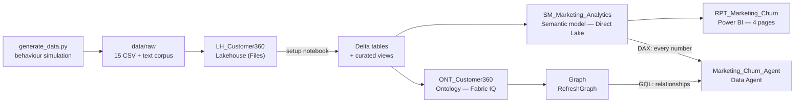

# Architecture — Fab-Marketing-Campaign

**Customer 360 + churn analytics on Microsoft Fabric.** CRM · Marketing · Commerce, wired so a
churn question can be *detected*, *diagnosed*, *quantified* and *acted on* — with numbers that
survive being challenged.

This document is the design source of truth. `README.md` is the front door; the code is the
implementation; this is the *why*.

---

## 1. The one rule everything else serves

> **Behaviour first, labels last.**

The generator simulates what each customer actually did — sends received, opens, clicks,
unsubscribes, orders, returns, support interactions — and only *then* derives
`churn_risk_score`, `clv_eur`, `risk_band` and `lifecycle_stage` from that behaviour.

It exists because the predecessor project did the opposite: it drew `churn_risk_score` from a
distribution. The result was a dataset that looked fine in a screenshot and collapsed under the
first real question:

Measured on the shipped dataset (buyers only, `seed=42`):

| Signal | Random-label predecessor | This project |
|---|---|---|
| churn ↔ days since last order | \|r\| < 0.02 | **r = +0.84** |
| churn ↔ orders in last 90 d | \|r\| < 0.02 | **r = −0.56** |
| churn ↔ engagement rate | \|r\| < 0.02 | **r = −0.39** |
| churn ↔ lifetime orders | \|r\| < 0.02 | **r = −0.32** |
| churn ↔ CLV | \|r\| < 0.02 | **r = −0.43** |
| churn ↔ NPS | \|r\| < 0.02 | **r = −0.17** |
| mean score, lapsed > 180 d vs recent buyers | flat | **59.1 vs 19.9** |
| mean score, unsubscribed vs subscribed | flat | **52.0 vs 28.6** |
| `total_orders` vs `orders.csv` | all zeros | reconciled row by row |
| "critical risk" *and* NPS-9 promoter | 5 % of the base | impossible by construction |

`tests/test_smoke.py` enforces this — correlation floors, direction of effect, band coverage,
aggregates matching the transactional truth. **Those thresholds are never weakened to make data
pass.** If a test fails, the data model is wrong, not the test.

### Churn applies to buyers only

A contact who never ordered has a **conversion** problem, not a churn problem. Scoring them
fills the remediation budget with people who were never customers. They get
`risk_band = "Prospect"` and `churn_risk_score = 0`, and every churn measure filters on
`is_customer = TRUE()`.

---

## 2. Layers



| Layer | Item | Answers |
|---|---|---|
| Storage | `LH_Customer360` | raw CSV → Delta, plus the text corpus for AI/RAG |
| Curation | setup notebook | Delta conversion + `v_churn_cohort`, `v_campaign_pressure` |
| Numbers | `SM_Marketing_Analytics` (Direct Lake) | 12 tables, 49 measures, DAX |
| Relationships | `ONT_Customer360` + graph | 8 entities, 9 relationships, GQL |
| Narrative | `RPT_Marketing_Churn` | 4 pages, 46 visuals |
| Conversation | `Marketing_Churn_Agent` | dual-source: GQL for *how/who*, DAX for *how much* |

---

## 3. Data model — 15 lakehouse tables

| Domain | Tables |
|---|---|
| **CRM** | `crm_accounts`, `crm_customers`, `crm_segments`, `crm_customer_segments`, `crm_interactions`, `crm_customer_profile` |
| **Marketing** | `marketing_campaigns`, `marketing_assets`, `marketing_audiences`, `marketing_sends`, `marketing_events` |
| **Commerce** | `products`, `orders`, `order_lines`, `returns` |
| **Text corpus** | `customer_knowledge_notes/*.txt` (1 500 generated, **400 uploaded**), `email_bodies/*.txt` (20) |

The note cap is deliberate: `deploy_lakehouse.upload_text_corpus(..., limit_notes=400)` uploads
420 files in total. Uploading all 1 500 costs minutes of one-file-at-a-time API calls and adds
nothing to the demo — the RAG story is already told by 400 notes.

`crm_customer_profile` is the analytical spine. Every column in it is **computed** from the
transactional tables: `churn_risk_score`, `risk_band`, `clv_eur`, `days_since_last_order`,
`orders_90d`, `orders_prev_90d`, `engagement_rate`, `click_rate`, `unsubscribed`,
`unresolved_interactions`, …

### The churn model

`churn_risk_score` (0–100) is a weighted blend of behavioural signals, each normalised 0–1.
Weights live in `config.yaml → churn_model.weights` and **must sum to 1.0** (tested).

| Signal | Weight | Meaning |
|---|---|---|
| Recency | 0.30 | days since last order |
| Frequency drop | 0.20 | orders last 90 d vs previous 90 d |
| Engagement decay | 0.20 | open rate vs the customer's *own* baseline |
| NPS | 0.15 | detractor = worse |
| Unsubscribed | 0.10 | opted out of email |
| Support friction | 0.05 | unresolved negative interactions |

Bands: **Low** 0–39 · **Medium** 40–64 · **High** 65–84 · **Critical** 85–100 ·
**Prospect** (never ordered). Bands must tile 0–100 with no gap or overlap — tested.
`at_risk_threshold: 65` defines the actionable cohort.

Engagement decay is measured against each customer's own baseline, not a global average. A
customer who always opened 8 % of emails and still opens 8 % is not decaying; one who fell from
40 % to 14 % is — even though 14 % is above the population mean.

---

## 4. The storyline

```
CAMP_007 "Black Friday Blast"
        │  over-mails (≈4× the sends of any other campaign)
        ▼
   SEG_HIGH_VALUE ──► unsubscribe spike ──► engagement halves ──► orders stop ──► churn
```

A *retention* campaign burns the segment it was meant to protect. Every step of the chain is
observable in the shipped data, not asserted in a slide.

Measured on the generated dataset (`seed=42`, config as committed):

| Signal | Culprit / burned cohort | Everyone else |
|---|---|---|
| sends per customer | **3.90** | 1.00 |
| unsubscribes | **247** | ≤ 28 |
| mean churn score (burned cohort, n = 2 492) | **33.9** | 23.7 |
| mean engagement rate | **0.121** | 0.214 |
| over-mailed cohort (≥ 2 sends, n = 3 890): churn / engagement | **29.5 / 0.156** | 24.1 / 0.214 |

**≈48 % of the at-risk cohort traces back to the culprit campaign** (825 at risk out of 12 000).

That number is deliberate, and `storyline.fatigue_share` is the dial that sets it:

- too low → the campaign is noise, RCA finds nothing;
- too high → "at risk" becomes a synonym for "received CAMP_007", the diagnosis is tautological
  and the demo answers a question it was told the answer to.

Half is the sweet spot: RCA has to *find* the cause, and there is a genuine residual cohort that
churned for other reasons. `test_root_cause_explains_about_half_the_at_risk_cohort` pins the
share to 30–80 %.

Not every targeted customer breaks, either — `fatigue_share = 0.62` leaves a resilient minority,
so "member of SEG_HIGH_VALUE" is a *risk factor*, never a perfect predictor.

**Demo arc:** detect (who is at risk) → diagnose (which campaign) → quantify (revenue and VIPs
exposed) → act (suppress, throttle, win back).

---

## 5. Semantic model — `SM_Marketing_Analytics`

Direct Lake over the lakehouse SQL endpoint. 12 tables (the three pure-lineage tables —
`crm_accounts`, `marketing_assets`, `marketing_audiences` — stay in the lakehouse and the
ontology, out of the star schema), 11 relationships, 49 measures, `fr-FR` culture,
`discourageImplicitMeasures = true`, plus a linguistic schema and verified answers for Copilot.

### Deploying it: never trust the 202

`updateDefinition` returns `202` and the operation polls to `Succeeded` **even when Fabric keeps
the previous definition**. This happened on this tenant: the model stayed one revision behind,
still exposing an obsolete `Line Revenue` and missing `Total Events` / `Product Revenue`, while
the deploy script printed OK. The report was then built against measures that did not exist.

`deploy_semantic_model.py` therefore does two extra things after the push:

1. `verify_deployment()` reads the definition back via `getDefinition` (Fabric returns **TMDL**,
   not the `model.bim` that was submitted — parse `^\s*measure\s+(.+?)\s*=`), diffs the
   `(table, measure)` inventory against what was sent, re-pushes on mismatch, and raises after
   three attempts. A silent partial apply is now a hard failure.
2. `reframe_direct_lake()` forces a full dataset refresh. **Direct Lake does not reframe by
   itself** when the setup notebook rewrites the Delta files, so without this the model — and
   everything downstream — keeps answering from the previous snapshot.

Note that these need *two different tokens*: the Fabric API uses
`helpers.get_fabric_token()` (`api.fabric.microsoft.com`), while dataset refresh and
`executeQueries` need `helpers.get_powerbi_token()` (`analysis.windows.net/powerbi/api`).

### Relationship design — the two traps

**Trap 1: ambiguous paths.** Power BI refuses a model with two routes between the same pair of
tables and the import fails outright. Several facts carry a denormalised `customer_id` that
*would* create a second route. They stay as attributes and are deliberately **not** related:

| Table | Denormalised column | Already reaches customers via |
|---|---|---|
| `marketing_events` | `customer_id`, `campaign_id` | `marketing_sends` |
| `returns` | `customer_id` | `orders` |
| `order_lines` | — | `orders` |
| `orders` | `attributed_campaign_id` | (nothing — intentionally unrelated) |

**Trap 2: filter direction.** Every relationship is many-to-one, `oneDirection`. Filters flow
from the "one" side to the "many" side **only**. This does not error — it silently renders the
grand total on every category. Consequences that constrain the report:

| You want to group by | You cannot use | Because | Use instead |
|---|---|---|---|
| `crm_customer_profile[risk_band]` | `[Total Customers]`, `[Revenue]` | profile → customers, not the reverse | `[Profiled Customers]`, `[Avg Churn Score]` |
| `crm_segments[segment_name]` | anything on customers/orders/sends | the bridge points *at* customers | `[Segment Memberships]` |
| `marketing_campaigns[campaign_name]` | `[Campaign ROI]`, `[Attributed Revenue]` | no orders → campaigns relationship | report-level totals only |
| `products[category]` | `[Revenue]` (on `orders`) | products relate to `order_lines` | `[Product Revenue]` |

Three measures exist purely to make legal groupings possible: `Profiled Customers`, `Buyers`
(on the profile), `Total Events` (on events) and `Product Revenue` (on order lines).

`test_report_groupings_respect_filter_direction` walks the relationship graph and fails any
visual that breaks this rule.

### Other DAX rules

- `COUNTROWS(FILTER(...))` returns **BLANK**, not 0 → wrap in `COALESCE(..., 0)`. Every
  count-style measure in the model does.
- Prefer existing measures over ad-hoc aggregation; `discourageImplicitMeasures` is on.

### One shared model, two generators: the deploy is a union

A semantic model is a **published contract**. Reports store measure references by name, so
renaming or deleting one does not fail the deploy — it fails at *render time*, in the consumer,
with `Something's wrong with one or more fields`. Fabric gives no warning at any point.

Two generators publish to this one model, and each script defines the model *in full*. Pushing it
therefore replaced everything: whoever deployed last erased the other's measures. That leaves only
two bad options — crush the other side, or block the deploy until someone merges by hand.

So the push is a **union, not a replacement**. `carry_over_measures_reports_use()` reads the live
model back, finds the measures this generator does not define, and for each one still referenced
by a report in the workspace, copies its DAX into the definition as `isHidden: true` before
pushing. Nobody has to know what the other generator defines.

- Measures **nobody uses** are still dropped — otherwise the model only ever grows.
- If the expression cannot be recovered (multi-line TMDL, or its table is gone), the deploy
  **refuses** rather than pushing an empty measure.
- If the read-back API is down, the carry-over is skipped with a warning, never a failed deploy.

Renaming stays a two-step move on top of that: add the new name, keep the old one as a hidden
alias, migrate consumers, then drop the alias. That is why `[Line Revenue]` still resolves to
`[Product Revenue]`.

---

## 6. Ontology and graph — `ONT_Customer360`

8 entity types (Customer, Account, Segment, Campaign, Asset, Product, Order, Interaction) and
9 relationship types, bound to lakehouse Delta tables.

**Deliberately no TimeSeries bindings.** Two sister projects proved the Fabric IQ TimeSeries
query path returns empty for a Data Agent: the GQL `entitySelector` resolves, the
`timeSeriesSelector` comes back with 0 rows — bound to a Kusto table *or* a lakehouse table,
before *and* after `RefreshGraph`. So this ontology models **relationships only**.

The demo edge is `CampaignSentToCustomer` (from `marketing_sends`): which campaigns actually
reached which customers. That single traversal answers "who did CAMP_007 burn, and what did
they buy".

`deploy_ontology.py` pushes entity/relationship definitions; `deploy_graph.py` builds the graph
item and triggers `RefreshGraph` to ingest.

---

## 7. Report — `RPT_Marketing_Churn`

**Legacy PBIX format only** (`report.json` with `sections[].visualContainers[]`). PBIR renders
blank in Fabric. Every visual carries a `prototypeQuery`; without one it is an empty box.

4 pages, 46 visuals — one per persona, each answering that persona's question:

| Page | Accent | Question it answers |
|---|---|---|
| Direction | `#00008F` | portfolio value, churn exposure, health of the customer relationship |
| Retention | `#027180` | which buyers score ≥ 65/100 — recency, engagement, unsubscribe, support friction |
| Marketing | `#896610` | email pressure per campaign: "Black Friday Blast" over-mails `SEG_HIGH_VALUE` |
| Commerce | `#863C41` | revenue, average basket, campaign contribution, product returns |

Read in order they walk the storyline end to end — Direction sees the exposure, Retention names
the cohort, Marketing finds the cause, Commerce quantifies the damage.

Visual conventions carried over from the sister demos:

- **Multi-colour bars**: put the *same* column in `Category` **and** `Series`, then hide the
  legend. `dataPoint.colorByCategory` does not work through the REST API.
- **Rounded cards**: `vcObjects.border` `show = true` + `radius = 10L`, plus a soft drop shadow
  on a `#F5F4F2` canvas — the Fluent-2 look.
- Theme name must match in three places (`report["theme"]`, `themeCollection.baseTheme.name`,
  the base theme JSON) or Fabric silently falls back to the default. Tested.

Palette comes from `theme/Accessible_Fluent2_Theme.json` — WCAG-checked and
colour-blind-distinguishable.

### Layout is not self-checking — validate it

Power BI **never shrinks a font to fit its box and never warns**: it clips. A textbox that is
30px tall with 17pt text loses its descenders, and a card sized against its callout alone cuts
off the label underneath. Nothing in the deploy pipeline notices — the JSON is perfectly valid.

The height model has **two terms, and conflating them is what makes estimates wrong**:

- **line height is proportional** to the font — 1pt = 4/3 px at 96 DPI, line box ≈1.35 × em,
  so **1.8 px per pt**;
- **padding is constant** and depends on the control, not the font — ≈8px per text element,
  plus ≈24px of card chrome (border, spacing, rounded corners).

A single "px per pt" multiplier cannot express a constant term: it under-sizes small text and
over-sizes large text. A first attempt used `height >= pt * 2.2`, which passed a 10pt subtitle in
a 22px box that actually needs 26px. Keep the terms separate:

```python
line_px(pt)        = pt * 1.8
text_height(pt)    = ceil(line_px(pt) + 8)               # one text element
card_height(*pts)  = ceil(sum(text_height(p)) + 24)      # a card stacks several
```

> **Each stacked text keeps its own padding — and this one *is* measured.** An earlier model
> collapsed the three per-block pads into a single container pad
> (`sum(line_px) + 8 + 24`, i.e. `sum(pt) * 1.8 + 32`). Under it, a 112px card holding
> 11 + 24 + 9 pt computed **111.2px and passed** — then shipped to Fabric and **rendered with its
> bottom label clipped on screen**. A render outranks a derivation, so the pads no longer collapse:
> the same stack now needs 128px and is correctly rejected.
> `test_the_card_stack_that_clipped_on_screen_is_rejected` locks that observation.
>
> The **1.8**, **8** and **24** themselves are still derived, not measured. Do not restate them as
> verified; re-check visually whenever a font size changes, and treat a passing validator as
> necessary, not sufficient.

| Element | Font(s) | Needs | Box |
|---|---|---|---|
| Page title | 17pt | 39px | 42 |
| Page subtitle | 10pt | 26px | 26 |
| Header band | — | 74px | 80 |
| KPI card (shipped) | 11 + **24**pt | 103px | 112 |
| KPI card (with label) | 11 + 24 + 9pt | 128px | ✗ clips |

**A card is not one line, and the cheapest fix is upstream of the geometry.** It stacks
`vcObjects.title` (11pt), `calloutValue` and `categoryLabel` (9pt). Two things were wrong at once:
a 30pt callout, and a category label rendering the **raw English measure name** ("Sends per
Customer") directly under a **French title that already said it** ("Emails / Client").

Dropping the callout to 24pt was not enough — 11 + 24 + 9 still needs 128px in a 112px box. The
label is therefore `show: false`: it was duplicated content *and* the clipped line. Two texts fit
where three did not, with 9px to spare. The vertical grid rarely has 10 spare pixels, but a page
almost always has a redundant label.

Consequence for the validator: it must model what is **rendered**, not what is declared. It reads
`show`, and treats an **absent** group as visible — that is Power BI's default, and inferring
"hidden" from a missing `fontSize` would under-reserve.

`validate_layout(report)` **blocks the deploy** on four defect classes: out-of-page bounds, text
too large for its box, **card stacks too tall for their card**, and overlapping visuals.
Collisions are only evaluated at `z >= 1`; the header band is a deliberate `z = 0` background
sitting under its own text and would otherwise raise 4 false positives per page.

Regression harness: `test_validator_detects_the_geometry_that_shipped` re-injects the original
geometry and asserts **exactly 32 defects** (8 clipped texts + 4 overlaps + 20 cards), so the
guard itself cannot silently stop working.

### Validate columns, not just measures

A broken **column** reference kills a visual exactly as hard as a broken measure, and
`EVALUATE ROW("v", [Measure])` will never catch it. `validate_fields()` tests both:

```dax
EVALUATE ROW("v", [Measure])                  -- measures
EVALUATE TOPN(1, VALUES('table'[column]))     -- columns
```

This gap is what let a broken report reach the user: only the measures had been tested.

---

## 8. Data Agent — `Marketing_Churn_Agent`

**Dual-source, and the routing is explicit in `aiInstructions`:**

| Question shape | Source | Language |
|---|---|---|
| *how much / how many / what rate* | `SM_Marketing_Analytics` | DAX |
| *how are these connected / who is affected / why* | `ONT_Customer360` | GQL |

Hard rules given to the agent:

- **Never** derive a count or a total by counting the rows a GQL query returned — the list is
  capped at 200 and the figure would be wrong. Numbers come from the semantic model.
- If aggregation in GQL is unavoidable, push `COUNT(DISTINCT …)` / `SUM(…)` into the query.
- For "detect then diagnose" questions: take the figure from the semantic model, then traverse
  the graph for the explanation.

`deploy_data_agent.py --ontology-only` deploys the single-source variant so the ontology
numeric path can be re-probed on this tenant before trusting it. Ontology-only is an
**experiment**, not the demo configuration.

---

## 9. Deploy

Strict order — each step depends on the previous one's `state.json` entry:

```
workspace → lakehouse → setup notebook (CSV→Delta) → semantic model
         → ontology → graph → report → data agent
```

```powershell
pip install -r requirements.txt
copy src\config.example.yaml src\config.yaml   # set capacity_id / tenant_id / az_subscription

python src\generate_data.py
python -m pytest tests\ -v --tb=short          # MANDATORY GATE
python src\deploy_all.py                       # idempotent, resumable, tenant-guarded
```

`deploy_all.py` also supports resuming and slicing:

```powershell
python src\deploy_all.py --from semantic_model   # resume from a step to the end
python src\deploy_all.py report data_agent       # run only these steps (order fixed)
python src\deploy_all.py --skip ontology,graph   # skip steps
python src\deploy_all.py --warmup                # warm-up only, no deploy
python src\deploy_all.py --no-warmup             # deploy only
```

The warm-up pays the Direct Lake / agent first-query latency off-stage, before the demo.

**Idempotency**: every script reuses the item id in `state.json`, falls back to finding the item
by name, and only creates when neither exists. Re-running resumes; it never duplicates.

**Tenant guard**: `az` silently flips to another tenant, which surfaces as `404 EntityNotFound`.
`deploy_all.py` pins `az account set --subscription <az_subscription>` first.

---

## 10. Inherited lessons — do not relearn these

| Lesson | Consequence if ignored |
|---|---|
| Data Agent must be **dual-source** | ontology-only cannot answer a single numeric question |
| Ontology TimeSeries path returns empty | value questions come back blank, twice proven |
| **Legacy PBIX** only, never PBIR | report renders blank |
| Every visual needs a `prototypeQuery` | empty box |
| Multi-colour bars need the column in Category **and** Series | one flat blue |
| No two routes between the same tables | semantic model import fails outright |
| Respect single-direction filter flow | every bar shows the same total, silently |
| `COUNTROWS(FILTER(...))` → BLANK | KPI cards show blank instead of 0 |
| **Renaming a measure is a breaking change** | live reports fail at render, no warning; the deploy is a union so the other generator's measures survive |
| **Validate columns, not just measures** | `ROW("v",[M])` misses broken column refs entirely |
| **Power BI clips text, never shrinks it** | `line_px = pt * 1.8` **plus** a constant pad (8px textbox, 32px card), both derived not measured; a single multiplier is wrong |
| **A card stacks 3 texts** (title + callout + label) | sizing on the callout alone clips the label; fix the font, not the box |
| **`updateDefinition` can return Succeeded and apply nothing** | always read the definition back |
| Capacity pauses when idle | resume before deploy or demo |
| Never `az rest` from a Python subprocess | it hangs; use `requests` + `az account get-access-token` |
| PowerShell `Set-Content -Encoding utf8` writes a BOM | JSON parsing breaks; use `[System.IO.File]::WriteAllText` with `UTF8Encoding $false` |
| venv activation can wipe terminal PATH | every deploy script restores it from Machine+User env |

---

## 11. Test gate

`tests/test_smoke.py` runs fully offline — no Fabric, no capacity, no auth. It is the gate
before **any** deploy script.

| Group | What it guards |
|---|---|
| Compilation | every `src/*.py` parses |
| Config | required keys, workspace name pinned, weights sum to 1, bands tile 0–100 |
| Referential integrity | no orphan FK across sends, orders, events, lines, segments, profile |
| **Churn signal** | correlation floors against 4 behavioural signals, direction of effect, all bands populated, churned out-scores active, prospects unscored |
| Aggregates | `total_orders` / spend reconcile with `orders.csv` row by row |
| **Storyline** | culprit over-mails, unsubscribes concentrate on it, over-mailed cohort is measurably worse, root cause explains 30–80 % of the at-risk cohort |
| Marketing plausibility | open rate, bounce rate, CTR, attribution share, AOV in credible ranges |
| **Report definition** | pages non-empty, every data visual has a `prototypeQuery`, every referenced table/column/measure exists in the model, projections match the query, groupings respect filter direction, theme name consistent, storyline named on the page |
| **Layout** | no clipped text, no overlapping visuals, nothing off-page, header band tall enough for its own text, cards clear of the header — plus a test that the rule *rejects* the geometry that originally shipped |
| **Model contract** | deprecated measure aliases still present and hidden, no duplicate measure names |
| **Shared-model union** | `carry_over_measures_reports_use()` carries over a live measure a report still uses (DAX verbatim, hidden), still drops unused ones, adds nothing it already defines, refuses when the expression cannot be recovered, and never fails the deploy on an API outage — mutation-tested (neutralising it turns two red) |
| **Item ownership** | the arc generator owns its own report name *and* its own `state.json` key, so it can never land on the other generator's item and never hands it ours — mutation-tested (sharing either one turns a test red) |

The report tests build the report and the model **in memory** and cross-check them against each
other. A visual referencing a measure that no longer exists, or grouping across a relationship
that cannot carry the filter, fails the build — before anything reaches Fabric.

Two further checks run **against the live tenant** at deploy time, because they cannot be done
offline: `validate_fields()` executes every measure *and column* reference through
`executeQueries`, and `carry_over_measures_reports_use()` reads the live model back so the push
becomes a union. The latter's *logic* is covered offline with stubs; only its API calls are not.
